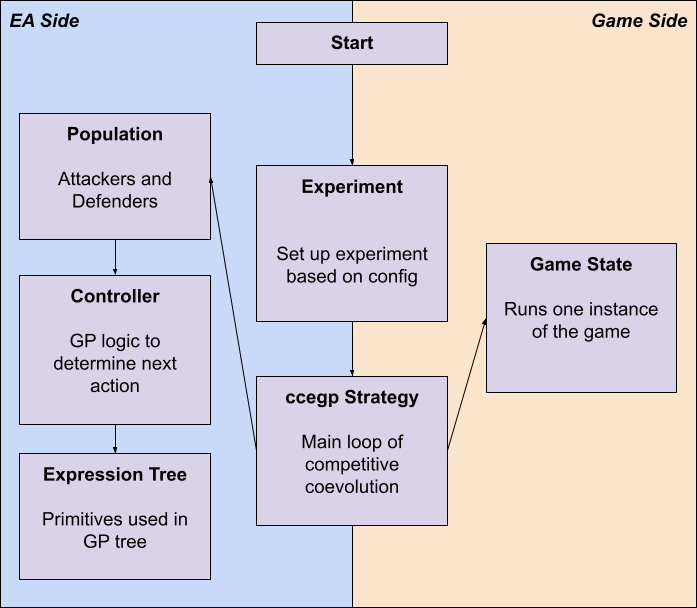

# continuous_auth
Continuous Authentication project for AI4Sec course

Project team:
- Alaeddin Almubayed, aas0072@auburn.edu
- Dennis Brown, dgb0028@auburn.edu
- Dongji Feng, dzf0023@auburn.edu
- Tripp Isbell, cai0004@auburn.edu

## Overview & Usage

This file is a quick guide to the code and other contents of this repository. Please see the accompanying final report for better context as to the actual purpose of this code.

Code was written in Python 3 and is all in the "code" folder.

Run it using run.sh:
```
./run.sh
```
```
./run.sh optional_config_filepath
```

The working directory is assumed to folder containing run.sh (i.e. one level above code / logs / problems / solutions folders).

Config files are in the configs subfolder. If no config file is specified, "default.cfg" is used and you're stuck with whatever is in it.

There are six relevant config files in the configs folder, cfga through cfgf, that match the scenarios A through F described in the project report.

Solution, log, and world files go into their respective subfolders; file names have the same root filename as the config files. The CIAO data goes into the data folder and plots into the plots folder.

Omitting the random seed from the config file results in initializing the random seed to an integer version of system time that is also written to the log file.

Malformed inputs generally cause the program to report an error and halt. Default values are employed where applicable, somewhat arbitrarily. User is highly encouraged to use command line and config file properly.

## Architecture



Execution kicks off in *start.py*, which parses command line arguments and sets up an Experiment instance.

The *Experiment* class contains the experiment parameters read from the config file, sets up the experiment, and executes the runs and evaluations of the experiment using a specified *Strategy*.

The *Strategy* class is the base class for solution strategies. It specifies initialization and execution (for one run) methods.

The *CCEGPStrategy* implements a Competitive Coevolutionary Genetic Programming search strategyt. It contains methods to perform initialization, selection, mutation, recombination, etc. of a population where individuals are expression trees.

The *Population* contains variables and methods specific to each population.

The *CIAOPlotter* class is called at the end of a run by CCEGPStrategy to plot a given matrix of normalized fitness values as a CIAO image and saves it to a PNG, all via matplotlib. As a standalone class, it can also load the matrix from a specified file and plot.

The *GameState* class contains the state of a game, a method to play a turn of the game, and helper functions to read and write files, calculate sensor data, handle bookkeeping, etc.

The *ExprTree* class represents an expression tree including a Node definition and methods to evaluate and print out a node (and its children, recursively).

The *controllers* module holds the *AttackerController* and *DefenderController* classes, which are basically fancy containers for an Expression Tree that can make moves with in the game.

The *runPlotter* etc. modules are just helpful utilities for me to make plots of experimental data. At this point the names are nonsensical and the code quality is atrocious. Please ignore them.

Sequence Diagram:


## Extras

We attempted to extend the functionality of the game environment by adding the capability for the user to play back actual recorded keystroke sequences during the game for which the attacker would attempt to listen and spoof. Due to time constraints, we did not complete this extended functionality in time; however, the code we do have for this capability is in the code/keystrokes folder.